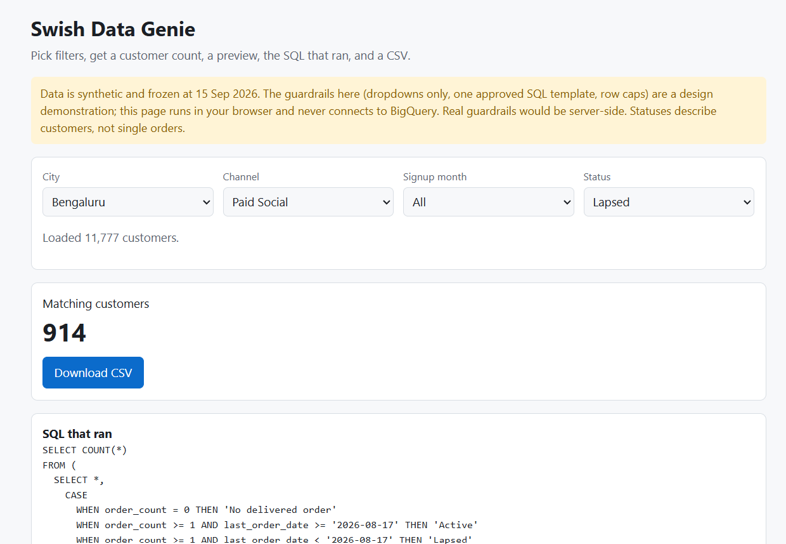

# Swish Data Genie: a self-serve win-back list builder for Growth Marketing

**Live demo:** https://sunit-majumdar.github.io/swish-data-genie/
**Related project:** [Swish growth analytics dashboard](https://github.com/sunit-majumdar/swish-growth-analytics)

> **Headline:** 85% of Bengaluru's Paid Social customers (914 of 1,079) have stopped ordering, the most of any Bengaluru channel. This page lets a marketer pull that win-back list in seconds, without writing SQL.

## The business problem

Swish is a Bengaluru-based 10-minute food delivery company that is expanding into new cities. Growth and Marketing want to win back customers who stopped ordering. Today, every customer list means asking an analyst to write a query.

The question this tool answers: **which customers should Marketing message, and how many are there?**

The related dashboard found that Bengaluru's Paid Social customers come back far less often than Hyderabad's (24.7% vs 61.0% ordered again in the month after joining). This tool turns that finding into an action: a list of customers to win back.

## Who it is for

A marketing or CRM manager who does not write SQL. They pick a city, channel, signup month and customer status from dropdowns. They get the number of customers, a 50-row preview, the SQL that ran (so an analyst can check it), and a CSV download.

## What I found

**1. Most customers have stopped ordering.**
Of 11,777 customers, 8,977 (76%) have had no delivered order in the last 30 days. Only 2,633 (22%) have. The other 167 (1%) have never had a delivered order. A list that long is too big to message at once, so it needs sorting.

**2. Bengaluru's Paid Social customers stopped ordering the most.**
85% of them (914 of 1,079) have gone quiet. For Bengaluru's other five channels, the figure is 73% to 81%. This matches the dashboard finding above.

The data cannot say why. Perhaps these customers joined for a discount and left, but that is only a guess, and this data cannot test it.

I compare channels inside Bengaluru on purpose. Hyderabad (69%) and Chennai (66%) look better, but those cities opened later, so their customers have had less time to stop ordering.

**3. Start with the customers most likely to come back.**
Of the 914 customers who stopped ordering:
- 594 (65%) had placed three or more delivered orders, so ordering was a habit for them.
- 188 last ordered on or after 17 Jun, so they stopped only recently.
- 123 are both: recent and a regular. This is the best first group to message.
- 112 ordered only once. They are the least likely to return.

## Recommendations

| Action | Who | Expected result | How to measure |
|---|---|---|---|
| Message the 123 recent, regular customers. Leave a random 1 in 5 unmessaged, to compare against. | CRM / Growth Marketing | Not known yet. This data has no customers who ever come back, so the test is how Swish would find out. | Share of customers who order again within 30 days: messaged vs unmessaged |
| Check how Paid Social customers in Bengaluru are targeted before spending more on it. | Growth Marketing | Fewer customers going quiet. Today the figure is 85%, against 73% to 81% for the other channels. | Share who order again in the month after joining, by campaign, for new sign-ups |

## Limits

- **Synthetic data.** Made up to resemble Swish's publicly known business. No real Swish figures are used, and this project is not affiliated with or endorsed by Swish.
- **Frozen data.** It ends 15 Sep 2026. The app never connects to BigQuery.
- **No win-back in the data.** In this synthetic data, a customer who stops ordering never starts again. So it cannot say how many stopped customers would respond to a message. That is why the first recommendation is a test.
- **Statuses describe customers, not single orders.** "No delivered order" means the customer has no completed delivery. It includes customers whose orders were all cancelled or refunded, and the data does not separate them from customers who never ordered.
- **The guardrails are a design demonstration** (dropdowns only, one fixed SQL template, a 50-row preview, a 2,000-row CSV limit). Real guardrails would sit on a server.

---

## Appendix

### Status rules

Every customer gets exactly one status. Two facts decide it: how many delivered orders the customer has, and the date of their last delivered order.

1. **No delivered orders at all?** Status: **No delivered order**.
2. **Otherwise, did their last delivered order fall on or after 17 Aug 2026?** Status: **Active**. They ordered in the last 30 days of data.
3. **Otherwise** their last delivered order was before 17 Aug 2026. Status: **Lapsed**. They ordered before, but not in the last 30 days.

*Why 17 Aug?* The data ends on 15 Sep 2026. Counting 17 Aug to 15 Sep, both days included, gives exactly 30 days.

Three example customers:

| Customer | What happened | Status |
|---|---|---|
| A | Last delivered order on 20 Jul | Lapsed (before 17 Aug) |
| B | Only order was cancelled | No delivered order |
| C | Last delivered order on 1 Sep | Active (on or after 17 Aug) |

### Data

One frozen customer-level file from BigQuery, with 11,777 rows (12,000 customers, less 223 with no channel or no matched city). Columns: customer_id, city, channel, signup_month, order_count (delivered orders only), last_order_date. It has no personal details.

### Stack

HTML and JavaScript, with sql.js (a database that runs inside the browser) and one fixed SQL template. Hosted on GitHub Pages.

### How I checked it

I counted these segments in BigQuery first, then confirmed the live app gives the same numbers:

| Segment | Total | No delivered order | Active | Lapsed |
|---|---|---|---|---|
| Bengaluru x Paid Social | 1,079 | 17 | 148 | 914 |
| Hyderabad x Paid Social | 300 | 5 | 89 | 206 |
| Chennai x Partnerships | 23 | 0 | 12 | 11 |

In all 36 city and channel combinations, the three statuses add up to the total. The CSV row count matches the count on screen.

### Run it locally

`python -m http.server`, then open http://localhost:8000.
